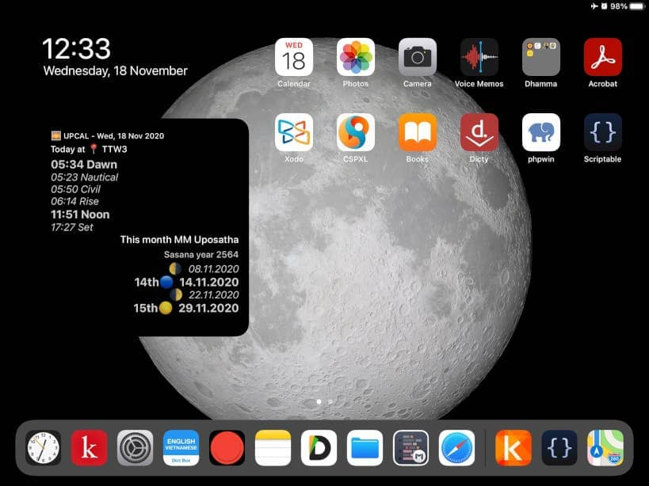

Upcal - Uposatha calendar and dawn time
----------------------------------------------

## 1. LT;DR; Instructions

+ This is a widget script to be run with [**Scriptable**](https://apps.apple.com/vn/app/scriptable/id1405459188) app on **iOS/iPadOS version 14 or later**.

+ Source code files are in the [docs](https://github.com/vpnry/upcal/docs).

+ Show calculated *Myanmar* uposatha dates for the current month & dawn time for the current date

+ List a whole year Uposatha dates of any  year when user running **Upcal_Widget** in app mode.

+ For Modern Myanmar Calendarical Calculations, see: [https://yan9a.github.io/mmcal/](https://yan9a.github.io/mmcal/)

## 2. HOW TO INSTALL

For details instructions, please see [https://vpnry.github.io/upcal](https://vpnry.github.io/upcal)

## 3. Open Source Libraries Acknowledgements 

  + Myanmar uposatha dates: powered by the algorithm of Modern Myanmar Calendrical Calculations - [MMCal](https://github.com/yan9a/mmcal) (Yan Naing Aye)  (MIT License)

  + Dawn time, sunrise...:  powered by [SunCalc](https://github.com/mourner/suncalc) (Vladimir Agafonkin) (MIT License)

  + Scriptable Widget and table UI is based on this [Coronavirus Scriptable Widget](https://gist.github.com/planecore/e7b4c1e5db2dd28b1a023860e831355e) (03 Oct 2020)

## 4. Feedback

+ If you have any suggestions or found bugs, may give feedback here on [Google Form](https://forms.gle/1FzEVDYajhNXSkad7).

+ May you all be well and happy! 
